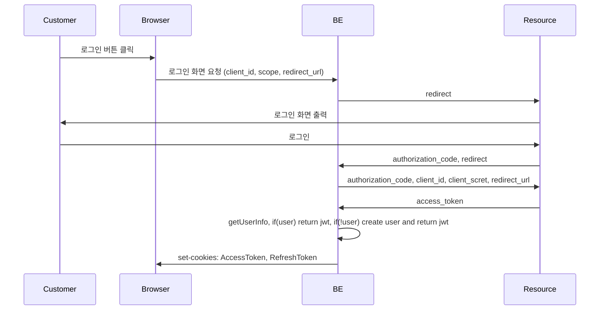
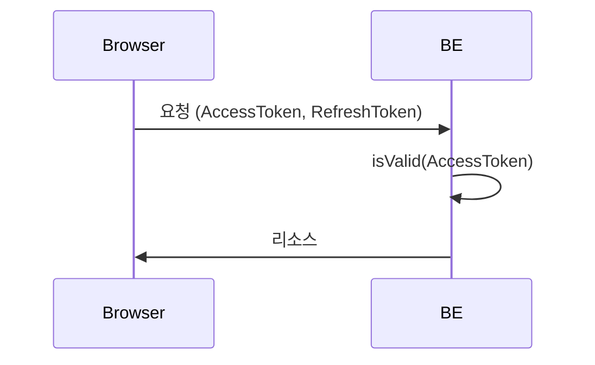
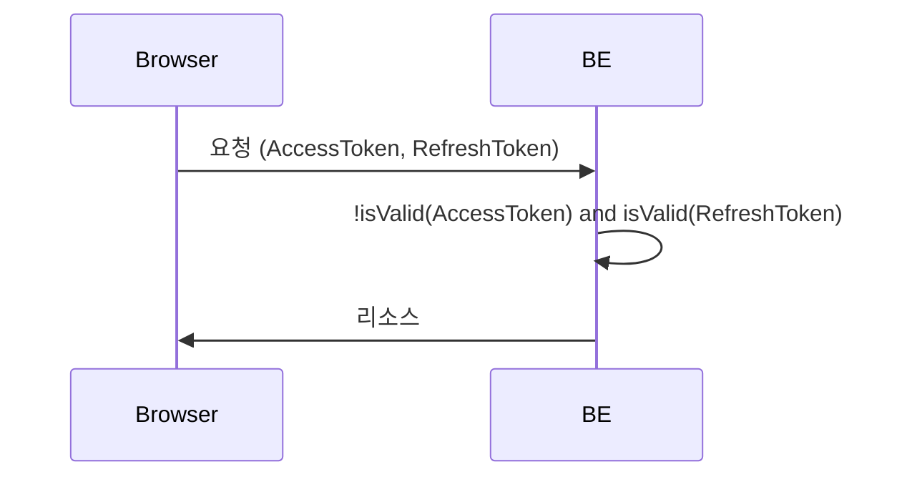
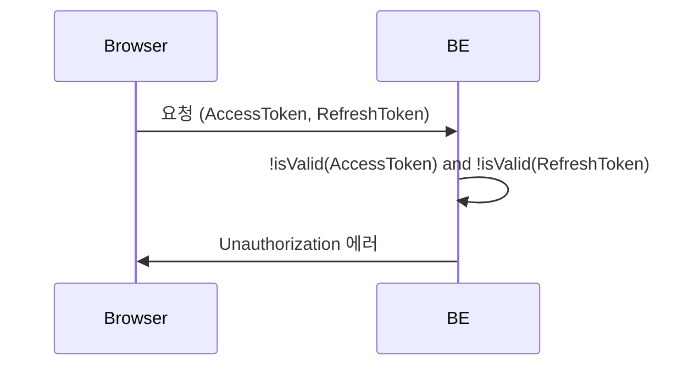

# 요구사항

### 유저 정보

- 유저는 google, apple 계정을 통해 로그인 할 수 있다.
- 유저는 기본 프로필을 설정 할 수 있으며, 그룹별로 별도 프로필을 설정 할 수 있다.
- 유저는 기본 유저네임을 설정 할 수 있으며, 그룹별로 별도 유저이름을 설정 할 수 있다.
- 기본 유저네임이 설정되지 않았다면, 유저이름을 설정하도록 안내한다.
- 기본 유저네임이 없이 본 서비스를 이용 할 수 없다.
- 그룹에 들어갈 때 프로필과 유저네임을 설정 할 수 있다.
- 유저는 email 정보를 필수로 입력 할 필요 없다.

### 그룹

- 유저는 그룹을 만들 수 있으며, 그룹 생성 시 그룹 이름을 지정한다.
- 그룹을 생성한 `group owner`라 칭한다. (약칭. 오너)
- 그룹에서 상호작용 하는 유저를 `group member`라 칭한다. (약칭. 멤버)
- 오너 또한 멤버라 칭할 수 있다.
- 오너는 초대링크를 통해 유저를 초대한다.
- 유저가 초대링크를 통해 접근하면, 오너가 수락한다.
- 오너 수락 이전에 유저는 그룹과 상호작용 할 수 없다.
- 오너는 멤버를 일방적으로 강퇴 할 수 있다.
- 오너는 그룹을 일방적으로 삭제 할 수 있다.

### 유저 활동

- 유저는 컨텐트를 등록 할 수 있다.
- 유저가 등록 할 수 있는 컨텐트의 종류는 사진, 비디오, 포스트, 버킷리스트, 스케쥴이 있다.
- 유저는 좋아요, 댓글을 통해 각 컨텐츠와 상호작용 할 수 있다.
- 댓글로 최대 `2200`자의 텍스트를 남길 수 있다.
- 한 컨텐트에 좋아요는 여러번 누를 수 있으나 연속으로 누르지 못하며 24시간 마다 누를 수 있다.

# 용어 정의

- user: 일반 사용자
- group: 그룹 앨범
  - group owner : 그룹 생성한 유저
  - group member : 그룹의 일반 유저
- content: 사진, 비디오, 포스트, 버킷리스트, 스케쥴 모두를 일컫는다.
- media: content 중에 사진, 비디오를 일컫는다.
- comment: 유저가 상호작용 할 수 있는 수단 중 하나로, 컨텐트와 관련된 텍스트를 남길 수 있다.
- like: 유저가 상호작용 할 수 있는 수단 중 하나로, 좋아요를 표시 할 수 있다.

# prerequisite

- [sqlitebrower](https://sqlitebrowser.org/)
- write `.env` file, reference : `.env.test`

# TODO

- Test 전반적 재작성 필요 - infra 측 테스트 시 e2e로 진행

# Rule

- 파일 이름은 케밥케이스로 작성한다.
- 폴더 이름은 축약 할 수 있으나 최종 파일 이름은 구현체의 이름을 그대로 따라간다. (파일 검색 용이성을 위함)

# 로직 구조

## Auth

### 1. 최초 로그인

### 2. 유효한 AccessToken

### 3. 유효하지 않은 AccessToken, 유효한 RefreshToken

### 4. 유효하지 않은 AccessToken, 유효하지 않은 RefreshToken

