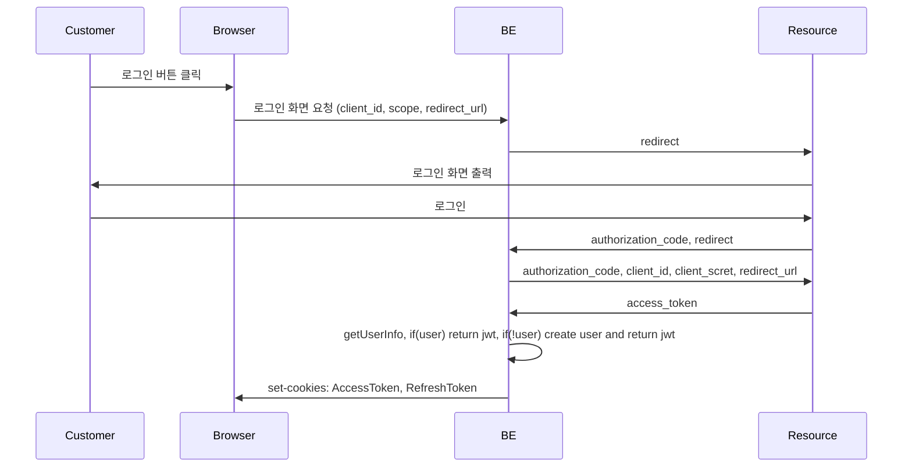
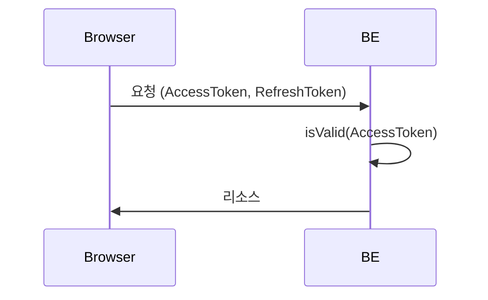
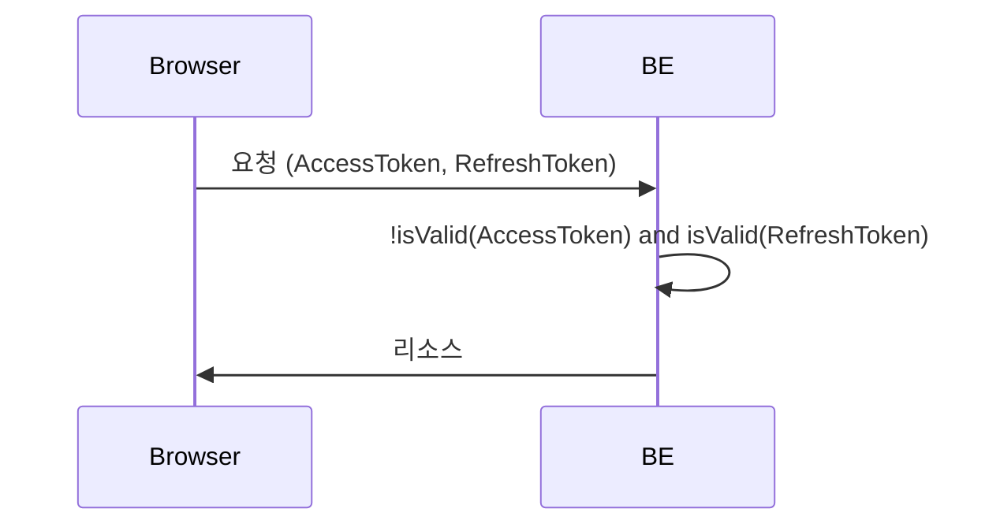
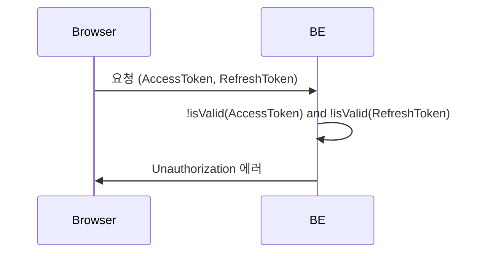
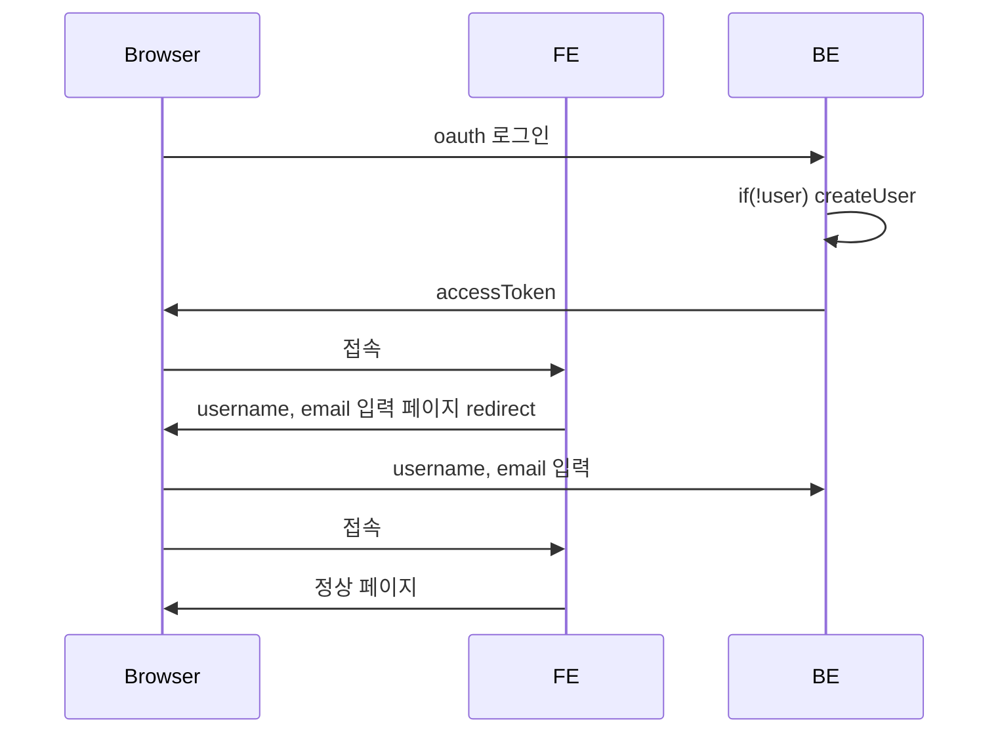
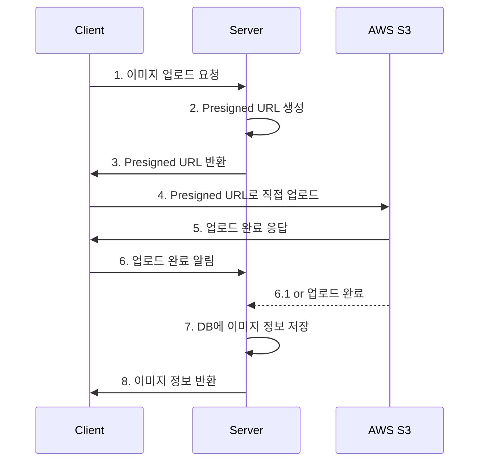
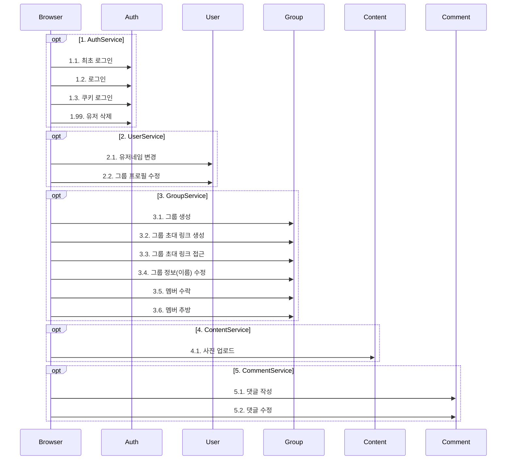

# 요구사항

### 유저 정보

- 유저는 google, apple 계정을 통해 로그인 할 수 있다.
- 유저는 기본 프로필을 설정 할 수 있으며, 그룹별로 별도 프로필을 설정 할 수 있다.
- 유저는 기본 유저네임을 설정 할 수 있으며, 그룹별로 별도 유저이름을 설정 할 수 있다.
- 기본 유저네임이 설정되지 않았다면, 유저이름을 설정하도록 안내한다.
- 기본 유저네임이 없이 본 서비스를 이용 할 수 없다.
- 그룹에 들어갈 때 프로필과 유저네임을 설정 할 수 있다.
- 한 그룹에서 같은 유저이름을 사용할 수 없다.
  - 유저이름이 같다면 뒤에 숫자를 추가하여 이름을 제안한다.
- 유저는 email 정보를 필수로 입력 할 필요 없다.
- 유저네임은 최대 `20`자의 텍스트이다.

### 그룹

- 유저는 그룹을 만들 수 있으며, 그룹 생성 시 그룹 이름을 지정한다.
- 그룹을 생성한 `group owner`라 칭한다. (약칭. 오너)
- 그룹에서 상호작용 하는 유저를 `group member`라 칭한다. (약칭. 멤버)
- 오너 또한 멤버라 칭할 수 있다.
- 오너는 초대링크를 통해 유저를 초대한다.
- 유저가 초대링크를 통해 접근하면, 오너가 수락한다.
- 오너 수락 이전에 유저는 그룹과 상호작용 할 수 없다.
- 오너는 멤버를 일방적으로 강퇴 할 수 있다.
- 오너는 그룹을 일방적으로 삭제 할 수 있다.

### 유저 활동

- 유저는 컨텐트를 등록 할 수 있다.
- 유저가 등록 할 수 있는 컨텐트의 종류는 사진, 비디오, 포스트, 버킷리스트, 스케쥴이 있다.
- 유저는 좋아요, 댓글을 통해 각 컨텐츠와 상호작용 할 수 있다.
- 댓글로 최대 `2200`자의 텍스트를 남길 수 있다.
- 한 컨텐트에 좋아요는 여러번 누를 수 있으나 연속으로 누르지 못하며 24시간 마다 누를 수 있다.

# 용어 정의

- user: 일반 사용자
  - (default) profile : username, profileImageUrl 로 이루어졌으며, 유저의 기본 정보이다.
  - group profile : default profile과 동일한 데이터 구조이나, 특정 group 내에서 사용 할 profile 이다.
- group: 그룹 앨범
  - group owner : 그룹 생성한 유저
  - group member : 그룹의 일반 유저
- content: 사진, 비디오, 포스트, 버킷리스트, 스케쥴 모두를 일컫는다.
- media: content 중에 사진, 비디오를 일컫는다.
- comment: 유저가 상호작용 할 수 있는 수단 중 하나로, 컨텐트와 관련된 텍스트를 남길 수 있다.
- like: 유저가 상호작용 할 수 있는 수단 중 하나로, 좋아요를 표시 할 수 있다.

# prerequisite

- [sqlitebrower](https://sqlitebrowser.org/)
- write `.env` file, reference : `.env.test`

# TODO

- Test 전반적 재작성 필요 - infra 측 테스트 시 e2e로 진행

# Rule

- 파일 이름은 케밥케이스로 작성한다.
- 폴더 이름은 축약 할 수 있으나 최종 파일 이름은 구현체의 이름을 그대로 따라간다. (파일 검색 용이성을 위함)

# 로직 구조

## Auth

### 1. 최초 로그인

### 2. 유효한 AccessToken

### 3. 유효하지 않은 AccessToken, 유효한 RefreshToken

### 4. 유효하지 않은 AccessToken, 유효하지 않은 RefreshToken

### 회원가입

현재 Browser에서 FE, BE를 번갈아가며 통신하고 있으나, FE 측의 redirect를 이용하려면 FE를 통해 통신하는 것이 좋아보임

## 이미지 업로드

## 서비스 흐름도

### 유저 가입 및 초대 수락

- 1.2. 로그인 > 2.1. 유저 이름 변경 > 3.1 그룹 생성 > 3.2. 그룹 초대 링크 생성 > (유저 알아서) 링크 공유
- 1.1. 최초 로그인 > 2.1. 유저네임 변경 > 3.3. 그룹 초대 링크 접근 > (3.5. 오너의 멤버 수락) > 5.1. 댓글 작성
- 1.2. 로그인 > 3.4. 그룹 이름 변경 > 3.5. 멤버 수락 > 4.1. 사진 업로드
- 1.3. 쿠키 로그인 > 3.4. 그룹 정보 수정 > 5.2. 댓글 수정

## 모듈 구성

- Auth : 유저 인증 관련한 모든 것
- User : 유저 관런 Service
- Group : 그룹 관련 Service
- Trpc : 상기 서비스들을 모아 trpc 함수 제공
  - seed : 테스트 시 자유롭게 테스팅 하기 위한 api로, production에 영향 없도록 주의 할 것.

## 에러 처리

### 에러 계층

1. 클라이언트 에러 (400-499)
   - 사용자 입력 오류 (400)
   - 인증/인가 오류 (401, 403)
   - 리소스 없음 (404)
   - 유효성 검증 오류 (422)
2. 서버 에러 (500-599)
   - 내부 서버 오류 (500)
   - 서비스 일시적 불가 (503)
   - 게이트웨이 타임아웃 (504)
3. 비즈니스 로직 에러
   - 도메인 규칙 위반
   - 비즈니스 제약 조건 위반
   - 트랜잭션 실패
4. 인프라스트럭처 에러
   - 데이터베이스 연결 오류
   - 외부 서비스 연동 오류
   - 캐시 서버 오류
   - 파일 시스템 오류
5. 치명적 에러
   - 메모리 부족
   - 디스크 공간 부족
   - 시스템 리소스 고갈
   - 프로그램 종료 필요

# 코드 약속

### 접두사

- D : decorator
- T : type
- I : interface
- S : zod schema
- E : enum
