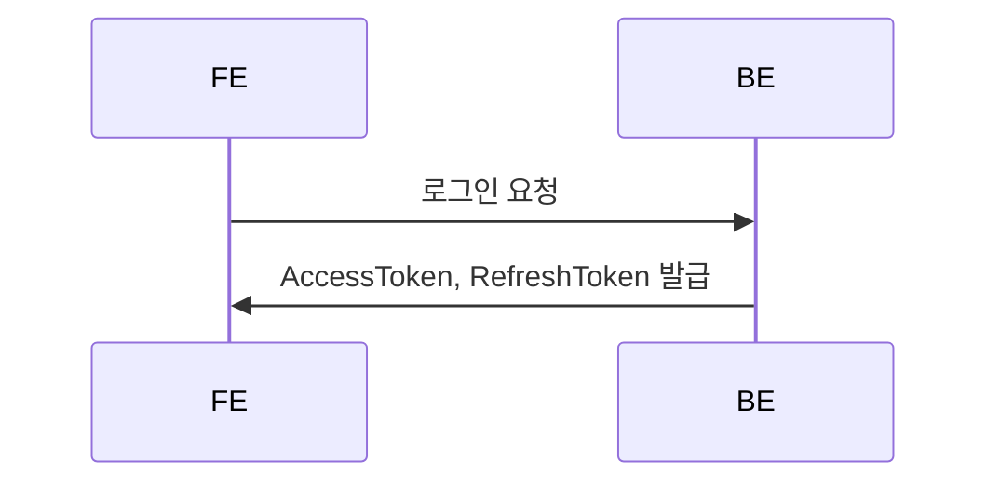
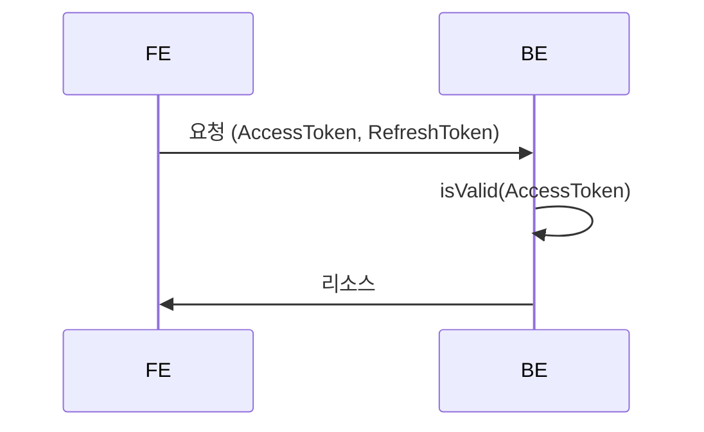
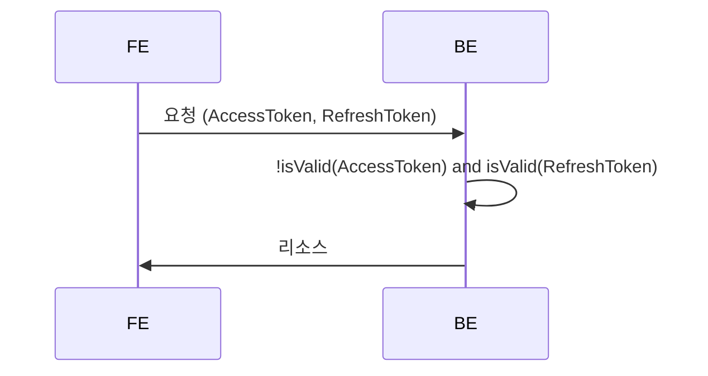
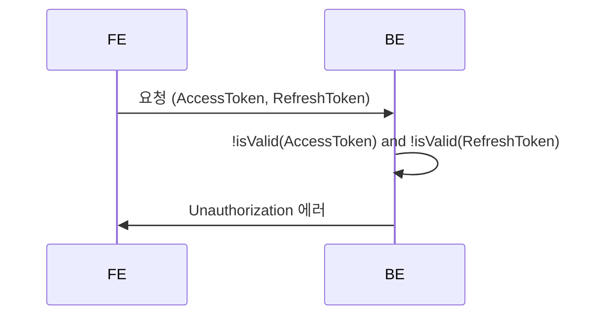

### prerequisite

- [sqlitebrower](https://sqlitebrowser.org/)
- write `.env` file, reference : `.env.test`

### TODO

- Test 전반적 재작성 필요 - infra 측 테스트 시 e2e로 진행

### Rule

- 파일 이름은 케밥케이스로 작성한다.
- 폴더 이름은 축약 할 수 있으나 최종 파일 이름은 구현체의 이름을 그대로 따라간다. (파일 검색 용이성을 위함)

## Auth

### 1. 최초 로그인 (Oauth 제외)

### 2. 유효한 AccessToken

### 3. 유효하지 않은 AccessToken, 유효한 RefreshToken

### 4. 유효하지 않은 AccessToken, 유효하지 않은 RefreshToken

